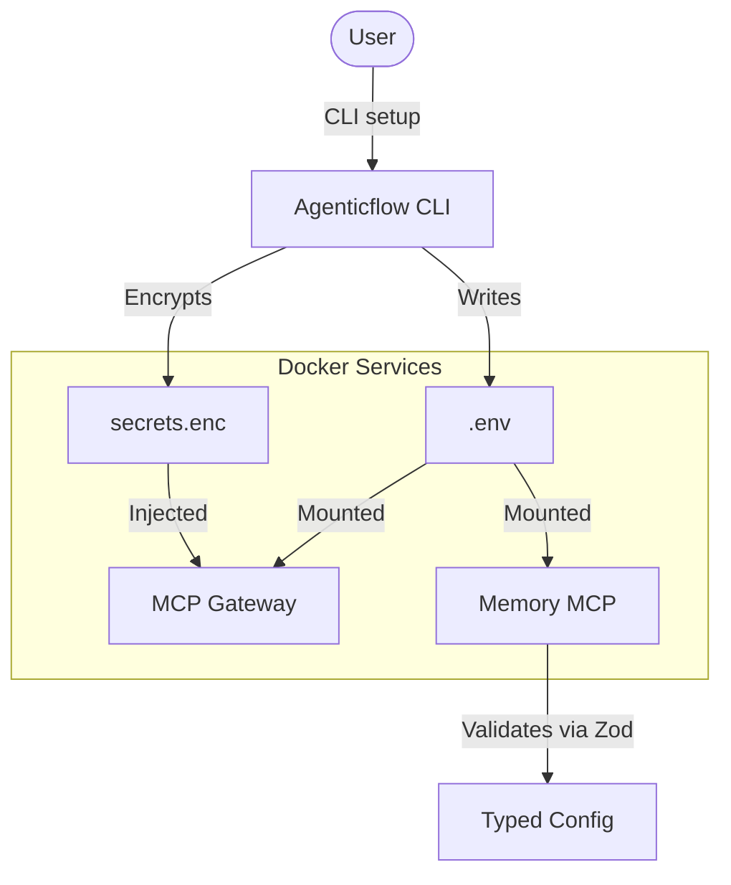

# Configuration Contract

This document defines the ownership, format, and flow of configuration settings in AgenticFlow.

## 1. Environment Variables (`.env`)
The `.env` file is the primary source of truth for runtime configuration and Docker orchestration.

- **Location**: Root directory of the project.
- **Ownership**: Managed by the CLI (`agenticflow setup`). Users can edit it manually, but the CLI will attempt to merge changes during re-configuration.
- **Key Variables**:
  - `VAULT_PATH`: Absolute path to the Obsidian vault.
  - `EMBEDDING_PROVIDER`: `local`, `ollama`, or `openai`.
  - `HOST_PORT`: The public port for the MCP gateway (default `18080`).
  *(Note: `AGENTICFLOW_MASTER_PASSWORD` is securely stored in the host OS native keychain, not in `.env`)*

## 2. Encrypted Secrets (`config/secrets.enc`)
Used for sensitive API tokens (e.g., Atlassian) that should not be stored in plain text in `.env`.

- **Location**: `config/secrets.enc`
- **Ownership**: CLI handles encryption/decryption. 
- **Key Derivation**: Scrypt/AES-256-GCM based on the `AGENTICFLOW_MASTER_PASSWORD`.

## 3. Configuration Flow

## 4. Stability Rules
- **No Manual Edits to `secrets.enc`**: It will corrupt the file. Use `agenticflow secrets set`.
- **Zod Validation**: All components must validate their required environment variables at startup and fail fast if missing or invalid.
