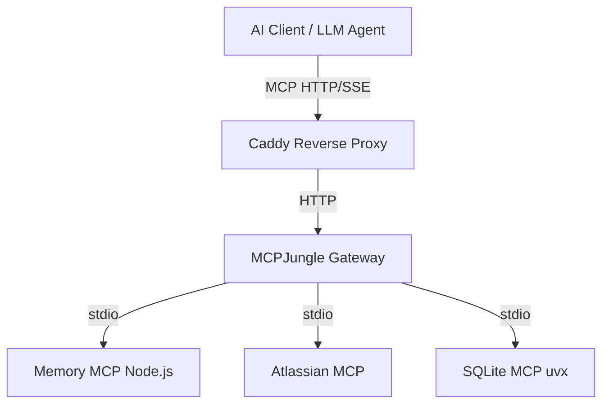
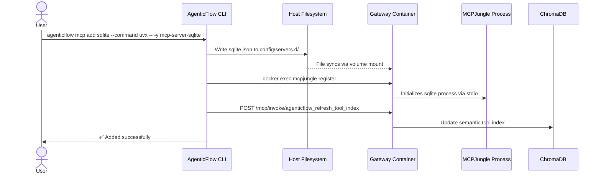

# MCP Gateway Architecture

AgenticFlow uses a robust, dynamically reloadable gateway architecture to manage Model Context Protocol (MCP) servers. This document explains how the CLI, the Docker container, and the internal `mcpjungle` process interact.

## Architecture Overview

The AgenticFlow gateway acts as a proxy and orchestrator for all underlying MCP servers (like the Obsidian Memory MCP, Atlassian, or user-added tools like SQLite or Puppeteer).

## How Servers are Added

When a user adds a new MCP server via the CLI, the following sequence occurs:

1. **CLI File Generation:** The CLI creates a JSON configuration file in the host's `config/servers.d/` directory.
2. **Volume Mount:** Because `config/servers.d/` is mounted into the `agenticflow-gateway` Docker container, the file becomes immediately available to the gateway.
3. **Dynamic Hot-Reloading:** The CLI executes a `docker exec` command to instruct `mcpjungle` to register the new server without restarting the container.
4. **Tool Discovery Refresh:** A background request is sent to the `agenticflow_refresh_tool_index` endpoint, forcing the semantic indexer to read the new tool definitions and add them to the vector database.

## Universal Execution Environment

To ensure maximum compatibility with the broader MCP ecosystem, the `agenticflow-gateway` container is equipped with multiple language runtimes:

- **Node.js (`npx`)**: For executing JavaScript/TypeScript based MCP servers.
- **Python 3 (`uvx`)**: Powered by Astral's `uv`, allowing blazing fast execution of Python-based MCP servers (e.g., `mcp-server-sqlite`, `mcp-server-fetch`) without requiring the user to manage local Python environments.

This allows the CLI to accept commands like `npx` or `uvx` and have them flawlessly executed inside the isolated gateway environment.

## Tool Discovery & Hidden Tools

AgenticFlow is designed to keep the primary LLM agent's context window clean by minimizing the number of tools directly exposed to it. Instead of exposing dozens of tools, AgenticFlow relies on a **discovery-first** architecture.

To achieve this, the core `agenticflow-memory-mcp` Node.js application is logically split into two roles using the `AGENTICFLOW_ROLE` environment variable:
1. **Discovery (`agenticflow` server):** Exposes only `discover_tools`, `call_tool`, and `refresh_tool_index`. This is the ONLY server directly exposed to the LLM.
2. **Memory/Notes (`memory` server):** Contains the actual note-taking and semantic search tools.

During container startup, `mcpjungle` registers the `memory` server but immediately disables it from the client-facing MCP protocol (`mcpjungle disable server memory`). The tools remain registered internally, meaning the semantic indexer (`refresh_tool_index`) can still read them, and the `call_tool` endpoint can still invoke them via `mcpjungle invoke`.
This forces the AI agent to proactively use `discover_tools` to find what it needs, matching semantic intent rather than relying on hardcoded tool names.